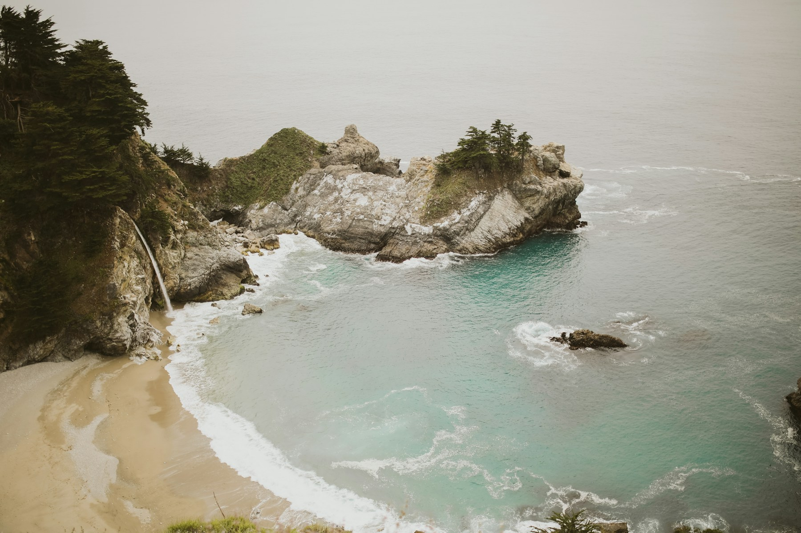
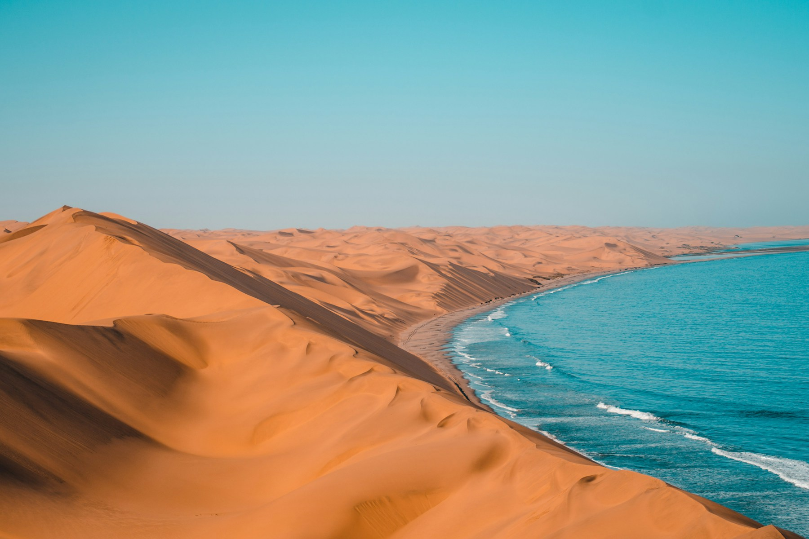

# JGallery

### Sponsor
Publicidade BH - Apps, Sistemas e sites - https://www.publicidadebh.com.br/

A lightweight and responsive JavaScript image and videos(youtube, vimeo and mp4) gallery library.

## Features

- 🖼️ Responsive image gallery
- 🚀 Lightweight and fast
- 🎨 Customizable styling
- 📱 Mobile-friendly
- 🔍 Image zoom support
- ⌨️ Keyboard navigation
- 🎯 Easy to integrate

## Installation

```bash
npm install jgallery
```

## Usage

```html
<!-- Include the CSS -->
<link rel="stylesheet" href="jgallery.min.css">

<!-- Create your gallery container -->
<div class="gallery">
			<a href="example/image1.jpg" class="jgallery-item" data-type="image">
				
			</a>
			<a href="example/image2.jpg" class="jgallery-item" data-type="image">
				
			</a>
			<a href="#" class="jgallery-item" data-type="video">
				<video poster="example/poster.jpg">
					<source src="example/video1.mp4" type="video/mp4">
				</video>
			</a>
			<a href="https://vimeo.com/76979871" class="jgallery-item" data-type="video">
				
			</a>
			<a href="https://www.youtube.com/watch?v=4FUnXaq_VWk" class="jgallery-item" data-type="video">
				
			</a>
		</div>

<!-- Include the JavaScript -->
<script src="jgallery.mni.js"></script>
<script>
    // Initialize the gallery
    $('.gallery a').jgallery({
        zoom: true
    });
</script>
```

## Configuration

```javascript
$('.gallery a').jgallery({
        zoom: true
    });
```

## API Reference

## Browser Support

- Chrome (latest)
- Firefox (latest)
- Safari (latest)
- Edge (latest)
- Opera (latest)

## License

This project is licensed under the MIT License - see the [LICENSE](LICENSE) file for details.

## Author

Leandro Lopes - leandrolopes.java@gmail.com - [GitHub Profile](https://github.com/leandrolopes13)

## Acknowledgments

- Thanks to all contributors who have helped make JGallery better
- Inspired by various gallery libraries in the JavaScript ecosystem